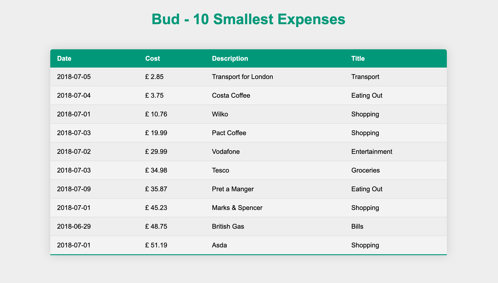
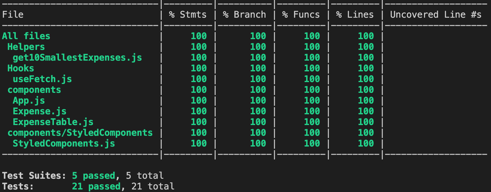

# Bud Development Exercise

Bud Development Exercise.



## Notes

- React v17
- Configured using Webpack
- Tested with Enzyme and Jest
  - 100% test coverage
- Linted using ESLint
- Built with StyledComponents

## Quick Start Guide

1. Clone this repository to your local machine.
2. Enter its root folder.
3. Install `node_modules` using:
```
npm install
```
4. Launch the app using:
```
npm run dev
```
5. Go to `localhost:9000`.


## Production build

1. Enter the projects root directory.
2. Install `node_modules` if you haven't already using:
```
npm install
```
3. Then you can use the command:
```
npm run build
```
4. This should bundle the production build into the `/dist` folder, where you should see:
   - `bundle.js`
   - `bundle.js.LICENSE.txt`
   - `main.bundle.css`
   - `index.html`
5. You can take a look at the production build by opening `/dist/index.html` in your browser.


## Testing

- This project has 100% test coverage.
- You can run the tests using:
```
npm run test
```
- To see test coverage run:
```
npm run test -- --coverage
```


